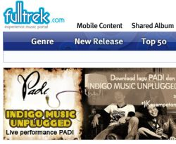

# My Work History

## Summary

|Title|Period|Language|Customer|Contractor|
|---|---|---|---|---|
|[영재교육종합데이터베이스 개발](#영재교육종합데이터베이스-ged-gifted-education-database-개발)|2010. 05 ~ 2010. 06|Java|한국교육개발원||
|[TELKOM _FullTrek_ 유지보수](#telkom-fulltrek-유지보수)|2010. 06 ~ 2010. 12|Java|Telkom|Uangel|
|[KB신용정보 I-WIN](#kb신용정보-i-win-고도화-개발)|2011. 01 ~ 2011. 03|Java|KB신용정보|KB신용정보|

## Detail

### 영재교육종합데이터베이스 _GED (Gifted Education Database)_ 개발

- 기간: 2010. 05 ~ 2010. 06
- 발주사: 한국교육개발원
- 수행사:
- 계약사: 이랜서

1. [Private Repository](https://github.com/sayingu/kedi_ged)
2. Maven등의 빌드 도구 미사용, 기본 설정은 .vscode/settings.json 참조
3. JSP 프로젝트
4. EUC-KR 인코딩

### TELKOM _FullTrek_ 유지보수

- 기간: 2010. 06 ~ 2010. 12
- 발주사: 인도네시아 TELKOM (현재 FullTrek 서비스는 종료)
- 수행사: 유엔젤 (분당 위치)
- 계약사: 이랜서

1. [Apache Axis2](https://axis.apache.org/axis2/java/core/index.html)
2. 음반사로 부터 음원 다운로드 및 사용자 스트리밍 관련 기술

### KB신용정보 _I-WIN_ 고도화 개발

- 기간: 2011. 01 ~ 2011. 03
- 발주사: KB신용정보
- 수행사: KB신용정보
- 계약사: 이랜서

1. [Private Repository](https://github.com/sayingu/2011.KBCI.01.I-WIN)
2. Maven등의 빌드 도구 미사용, 기본 설정은 .vscode/settings.json 참조
3. Java version: 1.4
4. JSP 프로젝트
5. EUC-KR 인코딩

### 디베이션 _Fendi Promotion_, _한국장학재단_ 개발

- 기간: 2011. 04 ~ 2011. 08
