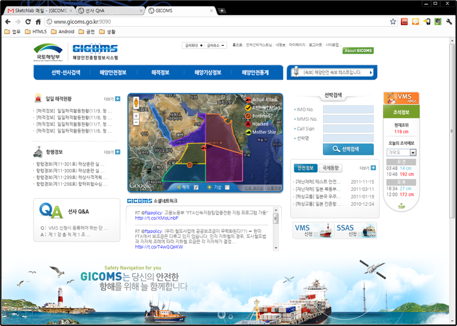

# My Work History

## Summary

|Title|Period|Language|Customer|Contractor|
|-----|------|--------|--------|----------|
|[LG CNS _EnTranslator_]()|2023. 06 ~ 2023. 12|Java|LG CNS|쉼|
|[현대오토에버]()|2022. 07 ~ 2022. 12|Java|현대오토에버|키트웍스|
|[SEMES]()|2021. 06 ~ 2021. 11|Java|SEMES|아이티사람들|
|[삼성전자]()|2020. 04 ~ |Java|삼성전자|노벨알엔디|
|[LG CNS _AI 빅데이터 플랫폼_]()|2019. 01 ~ 2019. 12|Java|LG CNS|누리꿈소프트|
|[아주캐피탈]()|2018. 11 ~ 2018. 12|Java|아주캐피탈|엠티콤|
|[트레블메이트]()|2018. 01 ~ 2018. 10|Java|트레블메이트|프레임아웃|
|[오스템임플란트 _DENALL_ 유지보수]()|2016. 06 ~ 2018. 01|Java|오스템임플란트|디지털플러스|
|나이스디앤비 _내부시스템_ 유지보수|2016. 02 ~ 2016. 05|Java|나이스디앤비|인비즈넷|
|[중외정보기술 _웹 ERP 시스템_ 개발](#중외정보기술-웹-erp-시스템-개발)|2015. 02 ~ 2016. 01|Java|중외정보기술|중외정보기술|
|[현대백화점 _SPIS_ 개발](#현대백화점-spis-개발)|2014. 09 ~ 2014. 11|Java|현대백화점||
|[한국공항공사 _전략적 인적자원개발(SHRD) 시스템 고도화_ 개발](#한국공항공사-전략적-인적자원개발shrd-시스템-고도화-개발)|2013. 08 ~ 2013. 12|Java|한국공항공사|(주)입소|
|[블루그리드 _웹접근성확보_ 프로젝트](#블루그리드-웹접근성확보-관련-개발)|2013. 05 ~ 2013. 07|Java|블루그리드|머스트플랜|
|[현대홈쇼핑 _Hmall 주민번호대체_ 개발](#현대홈쇼핑-hmall-주민번호대체-개발)|2013. 02 ~ 2013. 04|Java|현대홈쇼핑|머스트플랜|
|[디지캡 _uSBP (ucloud Security Broker Platform)_ 개발](#디지캡-usbp-ucloud-security-broker-platform-개발)|2012. 10 ~ 2013. 01|Java|디지캡|머스트플랜|
|[현대오토에버 _바츠아이티 고도화_ 개발](#현대오토에버-바츠아이티-고도화-개발)|2012. 08 ~ 2012. 09|Java|현대오토에버|엠로|
|[11번가 _전세계배송관리시스템_ 개발](#11번가-전세계배송관리시스템-개발)|2012. 04 ~ 2012. 07|Java|11번가|머스트플랜|
|[국토해양부 해양안전종합정보시스템 _GICOMS_ 개발](#국토해양부-해양안전종합정보시스템-gicoms-개발)|2011. 08 ~ 2012. 03|Java|해양안전부|스캐치랩|
|[Fendi _Promotion_ 개발](#fendi-promotion-개발)|2011. 04 ~ 2011. 07|Java|FENDI|디베이션|
|[KB신용정보 _I-WIN_ 고도화 개발](#kb신용정보-i-win-고도화-개발)|2011. 01 ~ 2011. 03|Java|KB신용정보|KB신용정보|
|[TELKOM _FullTrek_ 유지보수](#telkom-fulltrek-유지보수)|2010. 06 ~ 2010. 12|Java|Telkom|Uangel|
|[영재교육종합데이터베이스 _GED (Gifted Education Database)_ 개발](#영재교육종합데이터베이스-ged-gifted-education-database-개발)|2010. 05 ~ 2010. 06|Java|한국교육개발원||
|웹투게더 _물류 ERP 시스템_ 유지보수 및 개발|2006. 06 ~ 2009. 12|Java|웹투게더|웹투게더|

## Detail

### 중외정보기술 _웹 ERP 시스템_ 개발

- 중외정보기술 입사

#### (주)한국TEI 모발분석결과시스템 구축

- 기간: 2015. 02 ~ 2015. 03
- 발주사: (주)한국TEI
- 수행사: 중외정보기술

1. 기존 시스템(IMES)이 존재하고, 프로젝트 히스토리는 자세히 알수는 없었으나, 주니어 개발자와 함께 프로젝트 마무리
2. 양식지에 출력을 하는 기능이 있었는데(모발인식결과), 오픈소스 리포팅 라이브러리인 [Jasper Report](https://community.jaspersoft.com/) 로 제작함

#### 금양 ERP 구축

- 기간: 2015. 04 ~ 2016. 01
- 발주사: 금양 ERP
- 수행사: 중외정보기술

1. Spring framework 의 기본적일 설정을 완료함(Spring Security까지 적용)
2. 서버의 WAS (Tomcat) 설치, Jenkins 를 통한 CI/DI 까지 설치 및 설정

### 현대백화점 _SPIS_ 개발

- 기간: 2014. 09 ~ 2014. 11
- 발주사: 현대백화점
- 수행사:
- 계약사: 세종데이터시스템

1. 현대백화점의 VIP 고객 관리 시스템 개발
2. ~~지금 확인해 보니깐 퍼블리셔로 투입되어 있네?~~

### 한국공항공사 _전략적 인적자원개발(SHRD) 시스템 고도화_ 개발

- 기간: 2013. 08 ~ 2013. 12
- 발주사: 한국공항공사
- 수행사: (주)입소
- 계약사: 이랜서

1. 주로 보고서 파일(mrd)의 오류 수정 및 개발을 담당
2. 리포트 디자이너 라는 툴로 작업 하였고, 현재는 클립소프트의 클립 리포트
3. ~~eHRD 포탈의 디자인 변경도 함께 진행한듯~~

### 블루그리드 _웹접근성확보 관련_ 개발

- 기간: 2013. 05 ~ 2013. 07
- 발주사: 다수
- 수행사: 블루그리드
- 계약사: 머스트플랜

1. 웹접근성 인증이 필요한 사이트들에(주로 공공기관) 웹접근성 툴을 이용, 필요한 부분 수정
2. 주로 이미지 관련 수정이 많았음, _alt 태그 삽입 등_

### 현대홈쇼핑 _Hmall 주민번호대체_ 개발

- 기간: 2013. 02 ~ 2013. 04
- 발주사: 현대홈쇼핑
- 수행사: 머스트플랜
- 계약사: 머스트플랜

1. 사이트내에 주민번호를 전부 삭제

### 디지캡 _uSBP (ucloud Security Broker Platform)_ 개발

- 기간: 2012. 10 ~ 2013. 01
- 발주사: 디지캡
- 수행사: 머스트플랜
- 계약사: 머스트플랜

1. ucloud 보안 관리 플랫폼

### 현대오토에버 _바츠아이티 고도화_ 개발

- 기간: 2012. 08 ~ 2012. 09
- 발주사: 현대오토에버
- 수행사: 엠로
- 계약사: 엠로

1. [가장 질이 떨어지는 샘플 소스](https://github.com/sayingu/vaatzit-sample)
2. Maven등의 빌드 도구 미사용, 기본 설정은 .vscode/settings.json 참조

### 11번가 _전세계배송관리시스템_ 개발

- 기간: 2012. 04 ~ 2012. 07
- 발주사: 11번가
- 수행사:
- 계약사: 머스트플랜

### 국토해양부 해양안전종합정보시스템 _GICOMS_ 개발

- 기간: 2011. 08 ~ 2012. 03
- 발주사: 국토해양부
- 수행사: GMT
- 계약사: 스케치랩

1. 하기 사항 직접 Setting
2. 전자정부 프레임워크 1.0.0
3. Maven 빌드
4. 세계 기상정보 및 해적 정보 표출을 위해 Google map api 적용
5. 소셜 네트워크 연동을 위해 `jquery.twitter.js v1.5` `jquery.neosmart.fb.wall.js v1.2.7` 사용
6. 국내 기상정보 웹서비스 적용
7. 통계 그래프 및 태풍 위치정보 서비스를 위해 adobe flash 10 버전 적용

### Fendi _Promotion_ 개발

- 기간: 2011. 04 ~ 2011. 07
- 발주사: Post Visual
- 수행사: 디베이션
- 계약사: 디베이션

### KB신용정보 _I-WIN_ 고도화 개발

- 기간: 2011. 01 ~ 2011. 03
- 발주사: KB신용정보
- 수행사: KB신용정보
- 계약사: 이랜서

1. [Private Repository](https://github.com/sayingu/2011.KBCI.01.I-WIN)
2. Maven등의 빌드 도구 미사용, 기본 설정은 .vscode/settings.json 참조
3. Java version: 1.4
4. JSP 프로젝트
5. EUC-KR 인코딩

### TELKOM _FullTrek_ 유지보수

- 기간: 2010. 06 ~ 2010. 12
- 발주사: 인도네시아 TELKOM (현재 FullTrek 서비스는 종료)
- 수행사: 유엔젤 (분당 위치)
- 계약사: 이랜서

1. [Apache Axis2](https://axis.apache.org/axis2/java/core/index.html)
2. 음반사로 부터 음원 다운로드 및 사용자 스트리밍 관련 기술

### 영재교육종합데이터베이스 _GED (Gifted Education Database)_ 개발

- 기간: 2010. 05 ~ 2010. 06
- 발주사: 한국교육개발원
- 수행사:
- 계약사: 이랜서

1. [Private Repository](https://github.com/sayingu/kedi_ged)
2. Maven등의 빌드 도구 미사용, 기본 설정은 .vscode/settings.json 참조
3. JSP 프로젝트
4. EUC-KR 인코딩
